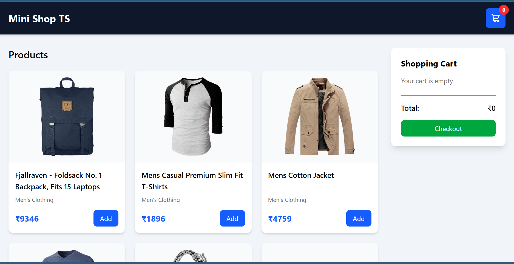
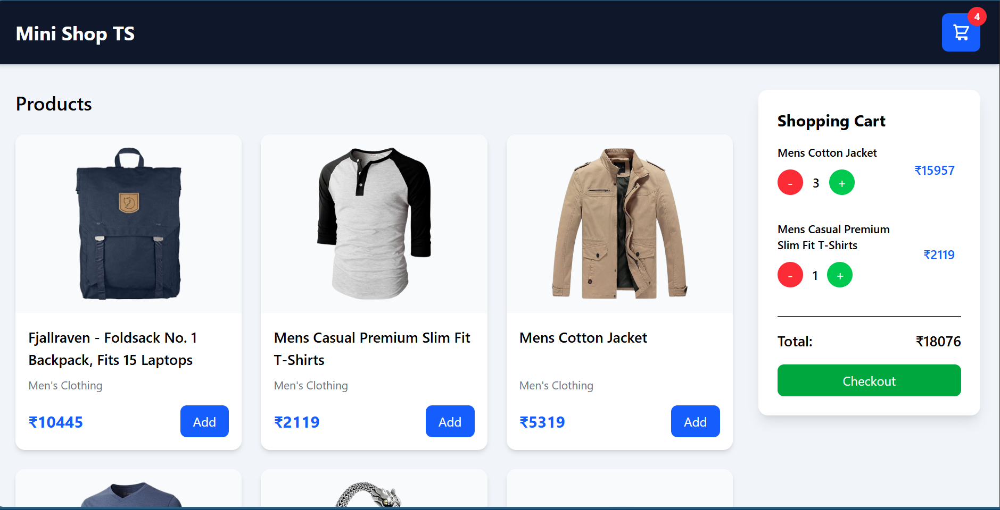
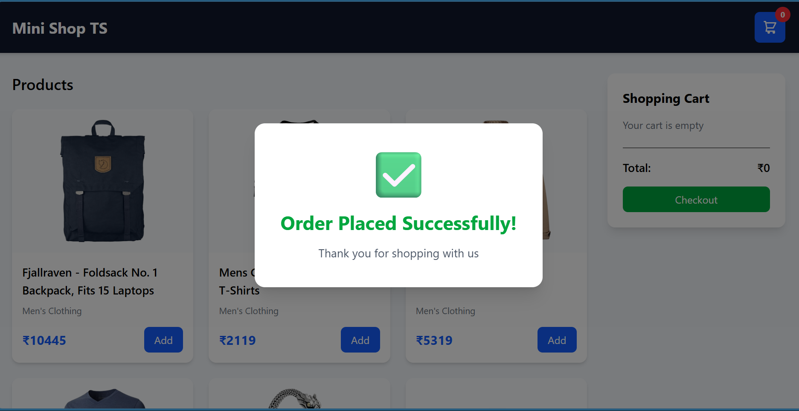

# 🛒 Mini Shop - Product Listing & Cart System (TypeScript)

A fully responsive **Product Listing & Cart System** built using **TypeScript, Tailwind CSS, and Fake Store API**.

This project is a refactored and upgraded version of the Phase 02 JavaScript Product Listing & Cart System (POC 3), rewritten entirely in **TypeScript** with strict type safety and dynamic product fetching from an API.

---

## 🚀 Project Overview

This application allows users to browse products, add them to a shopping cart, update product quantities, persist cart data using localStorage, and place orders through a complete checkout flow.

---

## ✨ Features

### 📦 Product Listing

- Fetch products dynamically from API
- Display product image, title, category, and price
- Responsive product grid layout

### 🛒 Cart Management

- Add product to cart
- Increase quantity
- Decrease quantity
- Real-time cart total calculation
- Cart item counter

### 💾 LocalStorage Persistence

- Save cart data
- Restore cart on page reload

### 🔔 Notifications & Alerts

- Toast notification on add to cart
- Warning alert for invalid checkout

### ✅ Checkout System

- Checkout success modal
- Page resets after checkout

### ⏳ Loading State

- Animated loading spinner while products are fetched

### 🔒 Type Safety

- Strict TypeScript typing
- No usage of `any`

---

## 🛠️ Tech Stack

- **TypeScript**
- **Tailwind CSS**
- **Fake Store API**
- **LocalStorage**
- **HTML5**
- **ES Modules**

---

## 📁 Folder Structure

```txt
mini-shop-ts/
│
├── src/
│   ├── services/
│   │   └── api.ts
│   │
│   ├── types/
│   │   └── index.ts
│   │
│   ├── utils/
│   │   └── storage.ts
|   |   └── Toast.ts
│   │
│   ├── cart.ts
│   └── app.ts
│   └── style.css
│
├── dist/
├── index.html
├── tsconfig.json
└── README.md
```

---

## 🧩 Type Definitions

### Product

```ts
interface Product {
  id: number;
  title: string;
  price: number;
  description: string;
  category: string;
  image: string;
}
```

---

### CartItem

```ts
interface CartItem {
  product: Product;
  quantity: number;
}
```

---

## ⚙️ Installation & Setup

### 1. Clone Repository

```bash
git clone <your-repo-link>
```

---

### 2. Navigate to Project

```bash
cd mini-shop-ts
```

---

### 3. Install TypeScript

```bash
npm install
```

---

### 4. Compile TypeScript

```bash
npm run dev
```

---

### 5. Run Tailwind

```bash
npx tailwindcss -i ./src/style.css -o ./dist/output.css --watch
```

---

### 6. Run Project

Open with Live Server

---

## 🔄 Application Flow

### Product Fetching

```txt
Load App
   ↓
Show Loader
   ↓
Fetch Products from API
   ↓
Hide Loader
   ↓
Render Products
```

---

### Add to Cart

```txt
Click Add
   ↓
Check Existing Product
   ↓
Increase Quantity OR Add New Item
   ↓
Save to LocalStorage
   ↓
Render Cart
```

---

### Checkout

```txt
Click Checkout
   ↓
Validate Cart
   ↓
Show Success Modal
   ↓
Clear Cart
   ↓
Reset Application
```

## 📸 Screenshots





---

## 👨‍💻 Author

**Pratik Jetani**
