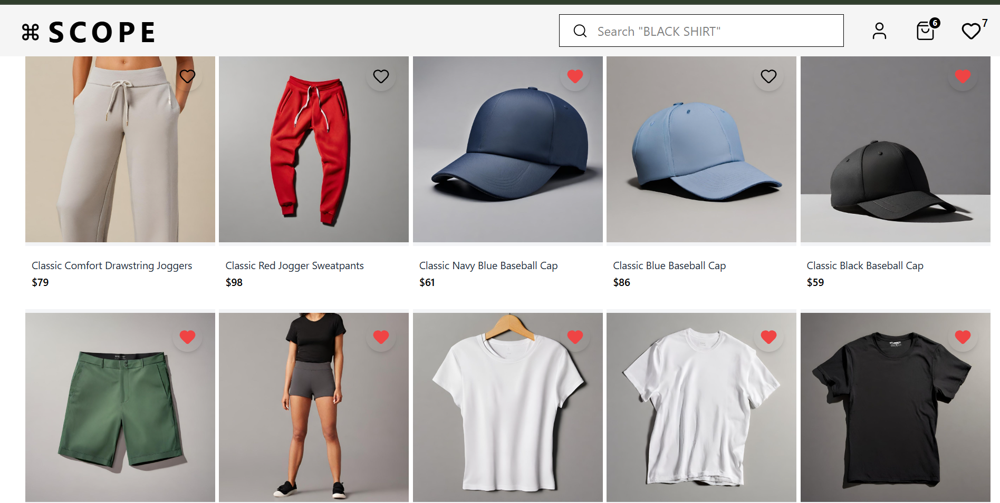
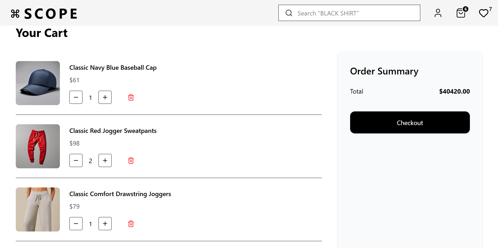
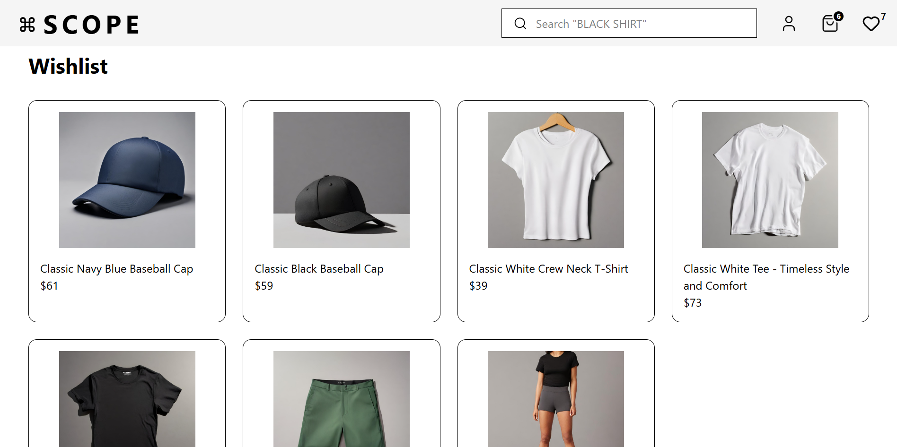

# SCOPE — React E-commerce Store

A modern e-commerce web application built with **React + TypeScript + Tailwind CSS**.

This project demonstrates advanced frontend concepts including product fetching, cart management, wishlist persistence, modal interactions, custom hooks, route separation, and scalable reusable architecture.

---

# Tech Stack

- React
- TypeScript
- Tailwind CSS
- React Router DOM
- Lucide React Icons
- Local Storage
- External Product API

---

# Features

## Product Listing

Products are fetched dynamically from API.

Features:

- Clothing category filtering
- Data sanitization
- Product grid layout
- Skeleton loading state

---

## Product Modal

Clicking a product opens a detailed modal.

Includes:

- Product images slider
- Expandable description (See More / See Less)
- Product price
- Add to cart
- Close modal

---

## Cart System

Users can:

- Add products to cart
- Increase quantity
- Decrease quantity
- Remove items
- View total price

Cart persists using localStorage.
Managed through custom hook: `useCart`

---

## Wishlist System

Users can:

- Add/remove wishlist items
- View wishlist page
- Persistent wishlist storage

Managed through custom hook: `useWishlist`

---

## Routing

Application routing is separated into: `AppRoute.tsx`

Pages:

- Home Page
- Cart Page
- Wishlist Page
- 404 Page

---

# Project Structure

```text
src/
 ├── components/
 │   ├── Header
 │   ├── Footer
 │   ├── ProductCard
 │   ├── ProductModal
 │   ├── ProductSkeleton
 │   └── CartItemCard
 |   └── CartSummary
 │
 ├── pages/
 │   ├── HomePage
 │   ├── CartPage
 │   ├── WishlistPage
 │   └── NotFoundPage
 |
 ├── hooks/
 │   ├── useCart
 │   └── useWishlist
 │
 ├── routes/
 │   └── AppRoutes
 │
 ├── services/
 │   └── productService
 │
 ├── utils/
 │   ├── Toast
 │   ├── cartStorage
 │   └── wishlistStorage
 │
 ├── types/
 ├── App.tsx
 └── Layout.tsx
```

---

# Application Flow

## 1. Product Loading Flow

```text
App loads
   ↓
Custom hooks initialize
   ↓
Load cart + wishlist from localStorage
   ↓
AppRoutes renders
```

---

## 2. Product Modal Flow

```text
User clicks ProductCard
   ↓
onOpen(product)
   ↓
selectedProduct state updates
   ↓
ProductModal opens
```

---

## 3. Add to Cart Flow

```text
User clicks Add to Cart
   ↓
useCart.addToCart()
   ↓
Cart updates
   ↓
localStorage sync
   ↓
Header count updates
   ↓
Toast notification appears
```

---

## 4. Wishlist Flow

```text
User clicks Heart icon
   ↓
useWishlist.toggleWishlist()
   ↓
Wishlist updates
   ↓
localStorage sync
   ↓
Wishlist page updates
```

---

# React Concepts Used

This project demonstrates:

- Functional Components
- TypeScript Interfaces
- Props
- State Management
- Custom Hooks
- useEffect
- Conditional Rendering
- Prop Drilling
- Event Handling
- Reusable Components
- Local Storage Persistence
- Routing
- API Integration

---

# Setup Instructions

## Install Dependencies

```bash
npm install
```

## Run Project

```bash
npm run dev
```

---

# Screen shot





# Future Improvements

- Context API / Redux
- Search functionality
- Authentication

---

# Author

**Pratik Jetani**
