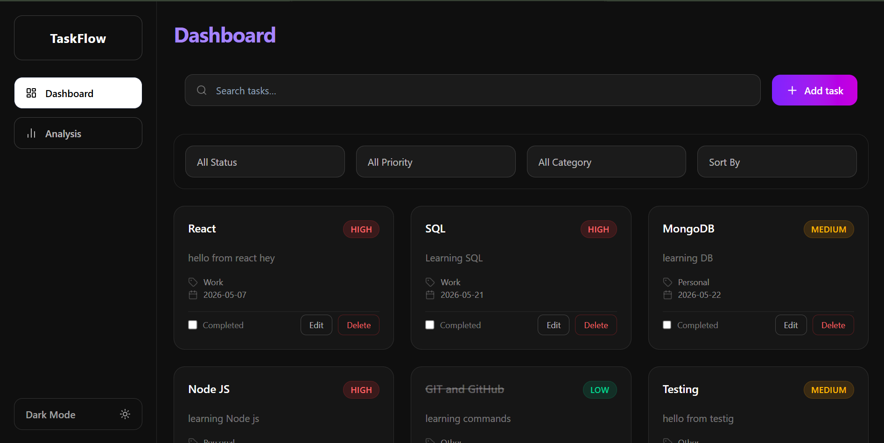
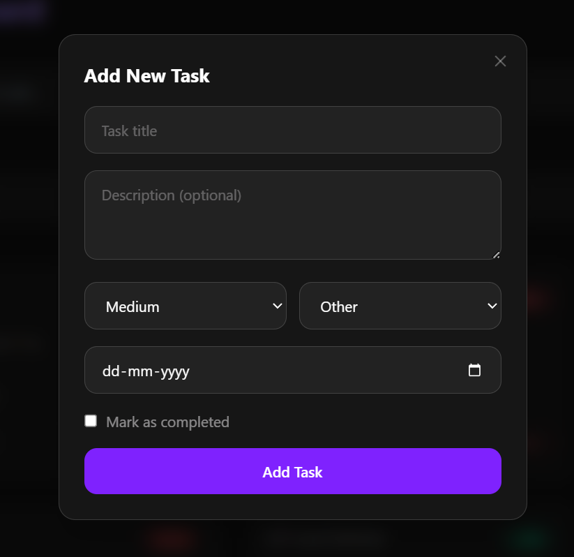
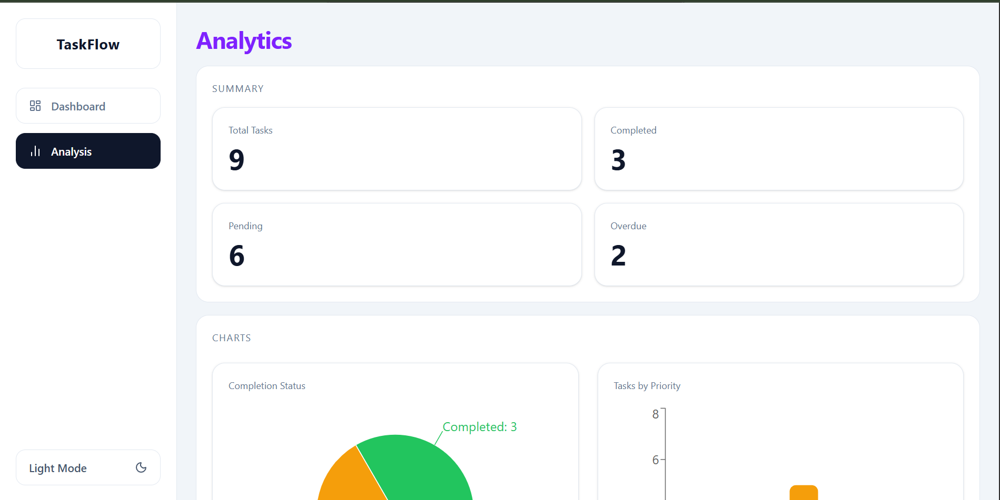

# TaskFlow — Enhanced Todo & Productivity Tracker

A modern productivity-focused task management application built with **React, TypeScript, and Tailwind CSS**.

TaskFlow helps users organize tasks efficiently with advanced filtering, analytics visualization, toast notifications, dark/light theme support, and persistent local storage.

---

## 🚀 Live Features

### Task Management

- Add new tasks
- Edit existing tasks
- Delete tasks (with custom confirmation modal)
- Mark tasks as completed
- Search tasks instantly

---

### Task Properties

Each task includes:

- Title
- Description
- Priority (Low / Medium / High)
- Category (Work / Personal / Other)
- Due Date
- Completion Status
- Created / Updated timestamps

---

### Filtering & Sorting

Filter tasks by:

- Status
  - All
  - Completed
  - Pending

- Priority
  - Low
  - Medium
  - High

- Category
  - Work
  - Personal
  - Other

- Sort tasks by:
  - Due Date
  - Priority

---

### Analytics Dashboard

Interactive visual analytics built using **Recharts**

Includes:

- Task Completion Pie Chart (`StatusPieChart`)
- Priority Distribution Bar Chart (`PriorityBarChart`)
- Category Distribution Bar Chart (`CategoryBarChart`)

---

### 🔔 Toast Notifications

Custom-built toast notification system (no third-party library) for:

- ✅ Task added successfully
- ✏️ Task updated successfully
- 🗑️ Task deleted successfully

Toast logic lives in `utils/Toast.ts` and is triggered from task action handlers.

---

### 🗑️ Custom Delete Confirmation Modal

Replaced the native `window.confirm` dialog with a fully custom **`DeleteConfirmModal`** component:

- Styled consistently with the app theme
- Supports light/dark mode
- Reusable across any delete action

---

### Theme Support

Global theme switching using **Context API** and a dedicated `useTheme` hook

Features:

- Light Mode
- Dark Mode
- Theme persistence using localStorage

---

## 🛠 Tech Stack

### Frontend

- React
- TypeScript
- Tailwind CSS
- React Router DOM
- Recharts

---

### State Management

- useState
- Custom Hooks
- Context API

---

## 📂 Project Structure

```txt
src/
│
├── assets/
│
├── components/
│   ├── charts/
│   ├── DeleteConfirmModal.tsx
│   ├── FilterControls.tsx
│   ├── Header.tsx
│   ├── Sidebar.tsx
│   ├── SummaryCard.tsx
│   ├── TaskCard.tsx
│   ├── TaskForm.tsx
│   └── TaskModal.tsx
│
├── context/
│
├── hooks/
│   ├── useLocalStorage.ts
│   └── useTheme.ts
│
├── layout/
│
├── pages/
│   ├── AnalyticsPage.tsx
│   └── DashboardPage.tsx
│
├── types/
│   └── index.ts
│
├── utils/
│   ├── analyticsData.ts
│   ├── constants.ts
│   ├── filterTasks.ts
│   ├── taskHelpers.ts
│   ├── taskStats.ts
│   └── Toast.ts
│
├── App.tsx
└── index.css
```

---

## ⚙️ Core Concepts Implemented

### Controlled Forms

Task creation/editing uses fully controlled React forms.

---

### Props Drilling

Parent-child communication for:

- Task updates
- Edit handling
- Modal state management

---

### Custom Hooks

Reusable localStorage logic via:

```tsx
useLocalStorage();
```

Reusable theme consumption via:

```tsx
useTheme();
```

---

### Context API

Global theme state handled through:

```tsx
ThemeProvider;
useTheme();
```

---

## 🎯 Key Learnings

- Building scalable React component architecture
- Controlled component patterns
- Reusable custom hooks
- React Router page separation
- Context API for global state
- Dark mode implementation
- Building custom utility-based toast notifications
- Replacing native browser dialogs with polished custom modals

---

## 🔍 Challenges Solved

### Add vs Edit task confusion

Solved by:

- Reusing `TaskForm`
- Passing `editingTask`
- Resetting form state correctly

---

### Theme inconsistency

Solved by:

- Shared theme helper classes
- Context consumption via `useTheme` across components

---

### Native dialog replacement

Replaced `window.confirm` for delete actions with the custom `DeleteConfirmModal` component for a consistent, theme-aware UX.

---

## 🏃 Installation

Install dependencies:

```bash
npm install
```

Run development server:

```bash
npm run dev
```

---

## Build for Production

```bash
npm run build
```

## ScreenShot





## 👨‍💻 Author

**Pratik Jetani**
